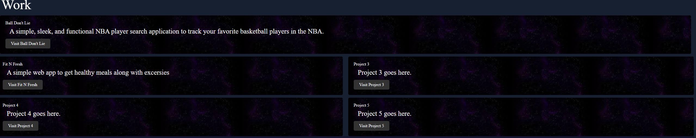

# Module 2 Challenge My First Portfolio

## Description

- Created my first portfolio using HTML and CSS
- I made this portfolio to showcase my projects
- I can use this portfolio webpage as a tool to show my future employers
- I learned the basics of HTML and CSS and how to make a mobile responsive web app

## Installation

Live Deployment on GitHub pages. No installation needed.

## Usage

To access my portfolio click the link provided on GitPages deployment.

Links in the Navbar to search in the page. Clicking on the will take you to their specific section.
Resume needs to be added.

Heading over to the Work section hover over the buttons and click to be directed to my projects.

Heading down to the contact section, there are 4 ways of contacting me click any link and reach out to me.

## Credits
Stackover Flow posts really helped me with completing this project.
https://stackoverflow.com/

## License

MIT License

Copyright (c) 2023 JosePerez013

Permission is hereby granted, free of charge, to any person obtaining a copy
of this software and associated documentation files (the "Software"), to deal
in the Software without restriction, including without limitation the rights
to use, copy, modify, merge, publish, distribute, sublicense, and/or sell
copies of the Software, and to permit persons to whom the Software is
furnished to do so, subject to the following conditions:

The above copyright notice and this permission notice shall be included in all
copies or substantial portions of the Software.

THE SOFTWARE IS PROVIDED "AS IS", WITHOUT WARRANTY OF ANY KIND, EXPRESS OR
IMPLIED, INCLUDING BUT NOT LIMITED TO THE WARRANTIES OF MERCHANTABILITY,
FITNESS FOR A PARTICULAR PURPOSE AND NONINFRINGEMENT. IN NO EVENT SHALL THE
AUTHORS OR COPYRIGHT HOLDERS BE LIABLE FOR ANY CLAIM, DAMAGES OR OTHER
LIABILITY, WHETHER IN AN ACTION OF CONTRACT, TORT OR OTHERWISE, ARISING FROM,
OUT OF OR IN CONNECTION WITH THE SOFTWARE OR THE USE OR OTHER DEALINGS IN THE
SOFTWARE.